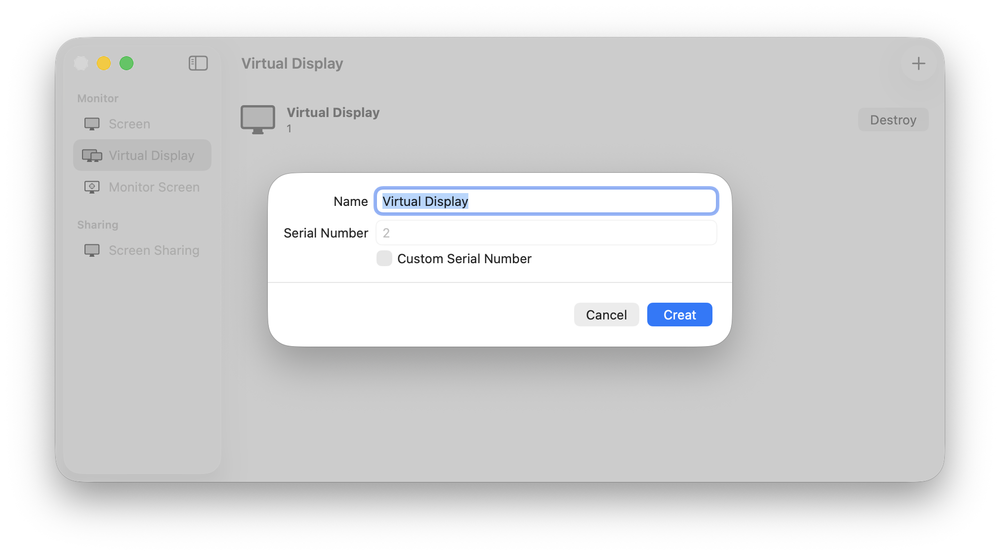
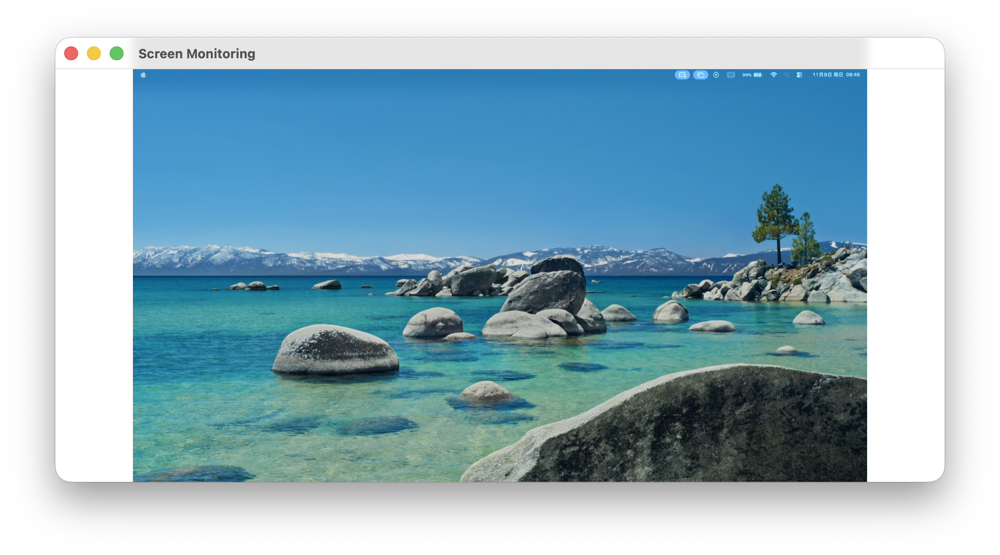

  
  <h1>FreelyDisplay</h1>
  <a href='./docs/Readme_cn-zh.md'>简体中文</a>

## Features

- Create virtual displays on Mac
- Share displays or windows over the network
- Can monitor multiple screens
- Graphical operation, simple and clear

## Functions

- Solve the problem of insufficient monitors
- Create virtual displays to avoid screen clutter when sharing screens in online meetings, etc.
- Real-time screen sharing over the network to participants in online meetings, etc.
- No physical monitor available but with other idle devices at hand

